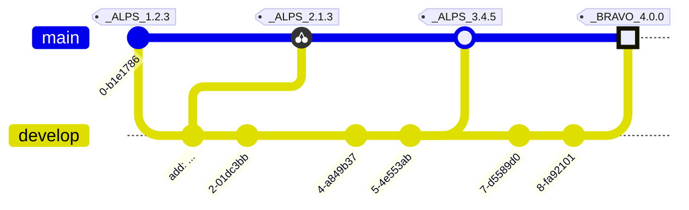

# GitNet

GitNet is a library ~~and cli framework~~ for automatically managing changelogs,
versioning, and tagging FSharp projects in a monorepo using ConventionalCommits spec,
and an early spec of a flavored semver that is purely made to delineate tags in a monorepo.

Using conventional commits, your ci will be able to automatically update your versions and
commit changes/tags, and write your release notes in a structured manner.

There will be functions to separate each step, or an *EZ* mode function to just run
everything with blind acceptance.

A CLI will be made to make this usable outside of FSX/FAKE.

You can see an early example of what the output looks like at this stage at the bottom
of the repo.

This should be mostly done by the end of the week.

> [!IMPORTANT]
> It's probably worth mentioning what GitNet plans to do differently.
> 
> For starters, this performs finer grained version bumps in a mono-repo. A commit
> must make changes to a directory/scope/project for that commit to be considered 
> as a part of that project. A major bump version in one project will not result in
> your whole repo blowing out.

This will be best for F# users, as it will *AUTOMATICALLY* discover your projects
unless configured to ignore them. It then observers whether commits have made changes to
that project directory to 'map' the commit to that project.

It will discover assembly files and update them for you. It will update the fsproj for you
with the new version details. All of this is configurable.

## Motivation

I have a mono repo like [Partas.Solid.Primitives](https://github.com/shayanhabibi/Partas.Solid.Primitives) which is a pain to manage and maintain.

## Configuration

## Design

- [x] Output type
  - [x] Splitting
    - [x] Mono file
    - [x] File per scope
    - [x] File per epoch
  - [x] Formatting
    - [x] Scope grouping
    - [x] Scope prefixing
      - [x] Prefix per scope
    - [x] Epoch grouping
- [x] Output path
  - [x] Output name (implicit to above)
  - [x] fine grained per project
- [x] Project type
  - [x] Fsharp
    - [x] Ignore projects
  - [x] General
    - [x] Defining scopes to paths
- [x] Scoping names
- [ ] Autobump error (error on attempt to create the file if it requires bumping)
- [x] Forced bump
  - [x] Bump for scope
  - [x] Bump target
  - [x] Bump all by patch/minor/major/epoch
- [x] Author specific
  - [x] ignore author (for bots etc)
- [x] Generate 'Release' notes for releases piped to output pre-formatted
  - [ ] GH auto release
- [x] Assembly file management
- [x] Scope settings
  - [x] no scoping (just normal commit logging)
  - [x] explicit scopes (only log scoped)
  - [x] autoscope (makes scopes for those not ignored)
  - [x] explicit scopes and noscoping (log explicit scopes, and bundle the rest, no version management though)
- [x] type/description keyword/footer -> bump type
- [x] grouping matcher
- [x] format groupings
- [ ] format content in general
- [x] exclude paths
- [x] initial versions if unset
- [x] github url

## Implementation

- [ ] Output type
  - [ ] Splitting
    - [x] Mono file
    - [ ] File per scope
    - [ ] File per epoch
  - [ ] Formatting
    - [x] Scope grouping
    - [x] Scope prefixing
      - [x] Prefix per scope
    - [ ] Epoch grouping
- [ ] Output path
  - [ ] Output name (implicit to above)
  - [ ] fine grained per project
- [x] Project type
  - [x] Fsharp
    - [x] Ignore projects
  - [x] General
    - [x] Defining scopes to paths
- [x] Scoping names
- [ ] Autobump error (error on attempt to create the file if it requires bumping)
- [ ] Forced bump
  - [ ] Bump for scope
  - [ ] Bump target
  - [ ] Bump all by patch/minor/major/epoch
- [x] Author specific
  - [x] ignore author (for bots etc)
- [ ] Generate 'Release' notes for releases piped to output pre-formatted
  - [ ] GH auto release
- [x] Assembly file management
- [x] Scope settings
  - [x] no scoping (just normal commit logging)
  - [ ] explicit scopes (only log scoped)
  - [ ] autoscope (makes scopes for those not ignored)
  - [ ] explicit scopes and noscoping (log explicit scopes, and bundle the rest, no version management though)
- [x] type/description keyword/footer -> bump type
- [x] grouping matcher
- [x] format groupings
- [ ] format content in general
- [x] exclude paths
- [x] initial versions if unset
- [x] github url
- [x] Temporarily version projects during build time so they reference each other correctly.


## API Brainstorming

```fsharp
let config =
    // make config
let runtime = new GitNetRuntime(config)
let bumps,output =
    runtime.Run()
    |> runtime.WriteAssemblyFiles
// bumps - dictionary of scopes to their
//         new sepoch semvers
// output - markdown output for the changelogs

runtime.VersionProjects(bumps) (* takes the
bumps and uses that to match the projects
which have their version and packageVersion
fields overwritten.

Disposal functions can be used to revert
the changes if desired.
`runtime.RevertVersionProjects()`
This can be dangerous, as you might accidentally use
old package versions in your build process.

If this is done in a CI process, you'll want
to commit the changes.
*)
runtime.CommitChanges("GitHub Actions", "noreply@github.com")

// Importantly, and an essential first step is to commit the tags
runtime.CommitTags(bumps.Values)
// The commit tag method just applies any sequence of tags to
// the repo. So you can make your own and shoot them in.
// Afterwards you'd probably want to regenerate the content of the
// markdown before you write it to a file.
```

<details>

# RELEASE NOTES

All notable changes to this project will be documented in this file.

The format is based on [Keep a Changelog](https://keepachangelog.com/en/1.0.0/),
and this project adheres to a flavored version of [Semantic Versioning](https://semver.org/spec/v2.0.0.html).

<details>
<summary>See the spec for this SemVer flavor.</summary>
<h3>Epoch Scoped Semver</h3>
This flavor adds an optional marketable value called an `EPOCH`.
There is also an optional disambiguating `SCOPE` identifier for delineating tags for packages in a mono repo.

<blockquote>The motivation for this is to prevent resistance to utilising SemVer major bumps
correctly, by allowing a separate marketable identifier which is easily compatible
with the current SemVer spec.</blockquote>
An Epoch/Scope (**Sepoch**) is an OPTIONAL prefix to a typical SemVer.

* A Sepoch MUST BE bounded by `_` underscores `_`.

* The identifiers MUST BE ALPHABETICAL (A-Za-z) identifiers.

* The Epoch SHOULD BE upper case

* The Epoch MUST come before the Scope, if both are present.

* The Scope MUST additionally be bounded by `(` parenthesis `)`.

* The Scope SHOULD BE capitalised/pascal cased.

* A Sepoch CAN BE separated from SemVer by a single white space where this is allowed (ie not allowed in git tags).

* Epoch DOES NOT influence precedence.

* Scope MUST uniquely identify a single components versioning.

* Different scopes CANNOT BE compared for precedence.

* A SemVer without a Scope CAN BE compared to a Scoped SemVer for compatibility. But caution is advised.

> There is no enforcement for ordering EPOCHs in this spec, as it
would be overly restrictive and yield little value since we can delineate and
earlier EPOCH from a later EPOCH by the SemVers.
>

**Examples:**



**While there are breaking changes between versions 1 to 3, we expect that it is less than
from 3 to 4. We expect the API surface would change more dramatically, or there is some other significant
milestone improvement, in the change from version 3 epoch ALPS to version 4 epoch BRAVO.**

```
_WILDLANDS(Core)_ 4.2.0
_WILDLANDS(Engine)_ 0.5.3
_DELTA(Core)_ 5.0.0
_DELTA(Engine)_ 0.5.3

```

**Cannot be compared to `Core` versions. Both Engine versions are equal, we can identify that
the ecosystems marketed change does not change the Engine packages API**

</details>
<details>
<summary>Quick navigation</summary>
<h3>Scopes:</h3>
<ul>
<li><a href="#ark">Ark</a></li>
<li><a href="#cmdk">Cmdk</a></li>
<li><a href="#corvu">Corvu</a></li>
<li><a href="#generator">Generator</a></li>
<li><a href="#jitbox">JitBox</a></li>
<li><a href="#tests">Tests</a></li>
<li><a href="#kobalte">Kobalte</a></li>
<li><a href="#lucide">Lucide</a></li>
<li><a href="#solid">Solid</a></li>
</ul>
</details>
-----------------------

# Ark

## UNRELEASED

-----------------------

# Cmdk

## UNRELEASED

* More components ported - cabboose@[f06cf](https://github.com/shayanhabibi/Oxpecker.Solid.JitBox/commit/f06cfedf0065b5fd561368360b5fedd02359b3d3)


* upd - cabboose@[e605d](https://github.com/shayanhabibi/Oxpecker.Solid.JitBox/commit/e605d50e5ec83b2adbc3b4cd77458807c8d91fc3)


* init repo - cabboose@[81662](https://github.com/shayanhabibi/Oxpecker.Solid.JitBox/commit/81662fca87fc1beaa7e5900484f4e973dd5c1926)


-----------------------

# Corvu

## UNRELEASED

* More components ported - cabboose@[f06cf](https://github.com/shayanhabibi/Oxpecker.Solid.JitBox/commit/f06cfedf0065b5fd561368360b5fedd02359b3d3)


* upd - cabboose@[e605d](https://github.com/shayanhabibi/Oxpecker.Solid.JitBox/commit/e605d50e5ec83b2adbc3b4cd77458807c8d91fc3)


* init repo - cabboose@[81662](https://github.com/shayanhabibi/Oxpecker.Solid.JitBox/commit/81662fca87fc1beaa7e5900484f4e973dd5c1926)


-----------------------

# Generator

## UNRELEASED

* Init - cabboose@[5d1e0](https://github.com/shayanhabibi/Oxpecker.Solid.JitBox/commit/5d1e079564fe56c6b97e1a3d22cb19b51a456465)


* init repo - cabboose@[81662](https://github.com/shayanhabibi/Oxpecker.Solid.JitBox/commit/81662fca87fc1beaa7e5900484f4e973dd5c1926)


-----------------------

# JitBox

## [UNRELEASED](https://github.com/shayanhabibi/Oxpecker.Solid.JitBox/compare/_%28JitBox%29_1.0.1...HEAD)

* chorgi - cabboose@[5f74a](https://github.com/shayanhabibi/Oxpecker.Solid.JitBox/commit/5f74a0cafd8857db61aef4d847762a2a4c5ac317)


## [1.0.1](https://github.com/shayanhabibi/Oxpecker.Solid.JitBox/compare/_%28JitBox%29_1.0.0..._%28JitBox%29_1.0.1) - (2025-8-18)

### <!-- 2 --> Fixed

* assemblyinfo - cabboose@[92498](https://github.com/shayanhabibi/Oxpecker.Solid.JitBox/commit/924989cca1766090506b17ae1c575b339a8e63ab)


## [1.0.0](https://github.com/shayanhabibi/Oxpecker.Solid.JitBox/compare/_%28JitBox%29_0.2.0..._%28JitBox%29_1.0.0) - (2025-8-18)

### <!-- 6 --> Others

* cheeky - cabboose@[0ddd3](https://github.com/shayanhabibi/Oxpecker.Solid.JitBox/commit/0ddd37662366df096fb2938a46603ff844c2b408)


* something - cabboose@[e7774](https://github.com/shayanhabibi/Oxpecker.Solid.JitBox/commit/e777474b6889b2fce4bca287ad4b121867e0dacd)


## [0.2.0](https://github.com/shayanhabibi/Oxpecker.Solid.JitBox/compare/_%28JitBox%29_0.1.0..._%28JitBox%29_0.2.0) - (2025-8-18)

### <!-- 1 --> Added

* blubber - cabboose@[fccf1](https://github.com/shayanhabibi/Oxpecker.Solid.JitBox/commit/fccf1526cff2d7981858bd81c40c864cc132a7b9)


-----------------------

# Tests

## UNRELEASED

* More components ported - cabboose@[f06cf](https://github.com/shayanhabibi/Oxpecker.Solid.JitBox/commit/f06cfedf0065b5fd561368360b5fedd02359b3d3)


* upod - cabboose@[f7eff](https://github.com/shayanhabibi/Oxpecker.Solid.JitBox/commit/f7effdcdc8b7b7ee3e8dd67f0578250863ab7702)


* Init - cabboose@[5d1e0](https://github.com/shayanhabibi/Oxpecker.Solid.JitBox/commit/5d1e079564fe56c6b97e1a3d22cb19b51a456465)


* init repo - cabboose@[81662](https://github.com/shayanhabibi/Oxpecker.Solid.JitBox/commit/81662fca87fc1beaa7e5900484f4e973dd5c1926)


-----------------------

# Kobalte

## UNRELEASED

* More components ported - cabboose@[f06cf](https://github.com/shayanhabibi/Oxpecker.Solid.JitBox/commit/f06cfedf0065b5fd561368360b5fedd02359b3d3)


* upd - cabboose@[e605d](https://github.com/shayanhabibi/Oxpecker.Solid.JitBox/commit/e605d50e5ec83b2adbc3b4cd77458807c8d91fc3)


* init repo - cabboose@[81662](https://github.com/shayanhabibi/Oxpecker.Solid.JitBox/commit/81662fca87fc1beaa7e5900484f4e973dd5c1926)


-----------------------

# Lucide

## UNRELEASED

* Init - cabboose@[5d1e0](https://github.com/shayanhabibi/Oxpecker.Solid.JitBox/commit/5d1e079564fe56c6b97e1a3d22cb19b51a456465)


* init repo - cabboose@[81662](https://github.com/shayanhabibi/Oxpecker.Solid.JitBox/commit/81662fca87fc1beaa7e5900484f4e973dd5c1926)


-----------------------

# Solid

## UNRELEASED

-----------------------

</details>
