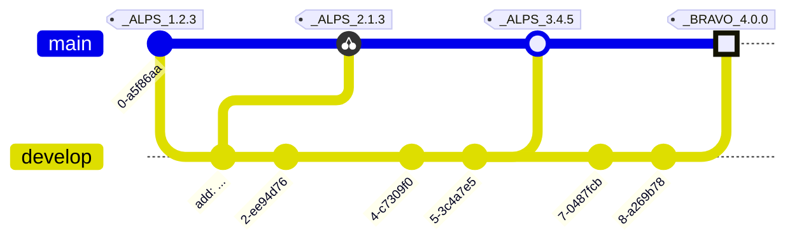

# RELEASE NOTES

All notable changes to this project will be documented in this file.

The format is based on [Keep a Changelog](https://keepachangelog.com/en/1.0.0/),
and this project adheres to a flavor of [Semantic Versioning](https://semver.org/spec/v2.0.0.html)
which includes [Scopes and Epochs](#epoch-scoped-semver).

---


#### Quick Navigation

**Scope** | Current Release | Commit Count
:--- | :---: | :---:
[**SepochSemver**](#sepochsemver) | [0.5.0](https://github.com/shayanhabibi/Partas.GitNet/compare/_%28SepochSemver%29_0.4.2..._%28SepochSemver%29_0.5.0) | 3 commits
[**GitNet**](#gitnet) | [0.1.0](https://github.com/shayanhabibi/Partas.GitNet/commit/b15e1aa40da98683e5e84b52b386219df71c512d) | None yet!
[**Markdown**](#markdown) | [0.1.0](https://github.com/shayanhabibi/Partas.GitNet/commit/c822ad300480de197d5415ccecf25a216a4434fa) | None yet!


-----------------------

# SepochSemver

### [UNRELEASED](https://github.com/shayanhabibi/Partas.GitNet/compare/_%28SepochSemver%29_0.5.0...HEAD)

### [0.5.0](https://github.com/shayanhabibi/Partas.GitNet/compare/_%28SepochSemver%29_0.4.2..._%28SepochSemver%29_0.5.0) - (2025-08-22)

#### <!-- 1 --> Added

* improve output formatting and add commit counts by [@cabboose](https://github.com/shayanhabibi/Partas.GitNet/cabboose) with [#b7fc9](https://github.com/shayanhabibi/Partas.GitNet/commit/b7fc9d345b01f23044076bde43da205e13d7aa81)
  

#### <!-- 6 --> Others

* init by [@cabboose](https://github.com/shayanhabibi/Partas.GitNet/cabboose) with [#0b1de](https://github.com/shayanhabibi/Partas.GitNet/commit/0b1de606a16bf4a973759662fd1dd080de024905)
  

* Init by [@cabboose](https://github.com/shayanhabibi/Partas.GitNet/cabboose) with [#cb67c](https://github.com/shayanhabibi/Partas.GitNet/commit/cb67cb3aff5439a7c97c55c60e0b8b2b90abd995)
  

<div align="right"><a href="#quick-navigation">(back to top)</a></div>

-----------------------

# GitNet

No commits at this time.

# Markdown

No commits at this time.


---

<details>
<summary>Read more about this SemVer flavor</summary>

### Epoch Scoped SemVer

This flavor adds an optional marketable value called an `EPOCH`.
There is also an optional disambiguating `SCOPE` identifier for delineating tags for packages in a mono repo.

<blockquote>The motivation for this is to prevent resistance to utilising SemVer major bumps
correctly, by allowing a separate marketable identifier which is easily compatible
with the current SemVer spec.</blockquote>


An Epoch/Scope (*Sepoch*) is an OPTIONAL prefix to a typical SemVer.

* A Sepoch MUST BE bounded by `_` underscores `_`.
* The identifiers MUST BE ALPHABETICAL (A-Za-z) identifiers.
* The Epoch SHOULD BE upper case
* The Epoch MUST come before the Scope, if both are present.
* The Scope MUST additionally be bounded by `(` parenthesis `)`.
* The Scope SHOULD BE capitalised/pascal cased.
* A Sepoch CAN BE separated from SemVer by a single white space where this is allowed (ie not allowed in git tags).
* Epoch DOES NOT influence precedence.
* Scope MUST uniquely identify a single components versioning.
* Different scopes CANNOT BE compared for precedence.
* A SemVer without a Scope CAN BE compared to a Scoped SemVer for compatibility. But caution is advised.

> There is no enforcement for ordering EPOCHs in this spec, as it
would be overly restrictive and yield little value since we can delineate and
earlier EPOCH from a later EPOCH by the SemVers.

#### Example



*While there are breaking changes between versions 1 to 3, we expect that it is less than
from 3 to 4. We expect the API surface would change more dramatically, or there is some other significant
milestone improvement, in the change from version 3 epoch ALPS to version 4 epoch BRAVO.*

```
_WILDLANDS(Core)_ 4.2.0
_WILDLANDS(Engine)_ 0.5.3
_DELTA(Core)_ 5.0.0
_DELTA(Engine)_ 0.5.3
```

*Cannot be compared to `Core` versions. Both Engine versions are equal, we can identify that
the ecosystems marketed change does not change the Engine packages API*

</details>

<!-- generated by Partas.GitNet -->
