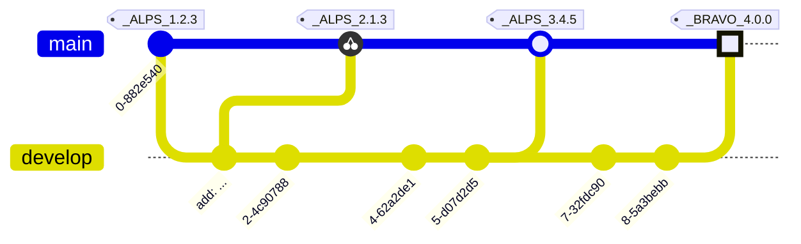

# RELEASE NOTES

All notable changes to this project will be documented in this file.

The format is based on [Keep a Changelog](https://keepachangelog.com/en/1.0.0/),
and this project adheres to a flavor of [Semantic Versioning](https://semver.org/spec/v2.0.0.html)
which includes [Scopes and Epochs](#epoch-scoped-semver).

---


#### Quick Navigation

**Scope** | Current Release | Commit Count
:--- | :---: | :---:
[**GitNet**](#gitnet) | [2.0.1](https://github.com/shayanhabibi/Partas.GitNet/compare/_%28GitNet%29_2.0.0..._%28GitNet%29_2.0.1) | 11 commits
[**SepochSemver**](#sepochsemver) | [0.5.0](https://github.com/shayanhabibi/Partas.GitNet/compare/_%28SepochSemver%29_0.4.2..._%28SepochSemver%29_0.5.0) | 3 commits
[**Markdown**](#markdown) | [0.1.0](https://github.com/shayanhabibi/Partas.GitNet/commit/c822ad300480de197d5415ccecf25a216a4434fa) | None yet!


-----------------------

# GitNet

### [UNRELEASED](https://github.com/shayanhabibi/Partas.GitNet/compare/_%28GitNet%29_2.0.1...HEAD)

### [2.0.1](https://github.com/shayanhabibi/Partas.GitNet/compare/_%28GitNet%29_2.0.0..._%28GitNet%29_2.0.1) - (2025-11-24)

#### <!-- 2 --> Fixed

* CrackedProject stage helpers include the path to the project directory by [@shayanhabibi](https://github.com/shayanhabibi) with [#6c984](https://github.com/shayanhabibi/Partas.GitNet/commit/6c9848047a30fe0d3801be5d509cae731c68cb67)
  

### [2.0.0](https://github.com/shayanhabibi/Partas.GitNet/compare/_%28GitNet%29_1.2.0..._%28GitNet%29_2.0.0) - (2025-11-24)

#### <!-- 1 --> Added

* Reduce API surface and introduce project file helpers (#7) by [@cabboose](https://github.com/cabboose) with [#7f78b](https://github.com/shayanhabibi/Partas.GitNet/commit/7f78b41e01f13a55e8f8383092cc83d17e49f447)
  

### [1.2.0](https://github.com/shayanhabibi/Partas.GitNet/compare/_%28GitNet%29_1.1.2..._%28GitNet%29_1.2.0) - (2025-11-24)

#### <!-- 1 --> Added

* CrackedProject helpers for modifying project files and staging files by [@cabboose](https://github.com/cabboose) with [#8f1f2](https://github.com/shayanhabibi/Partas.GitNet/commit/8f1f2127bbe3bd748477d0076088723035e0fe49)
  

#### <!-- 6 --> Others

* Revert "refactor!: Slim API and add proj helpers  " (#6) by [@cabboose](https://github.com/cabboose) with [#d8cac](https://github.com/shayanhabibi/Partas.GitNet/commit/d8cacf7fb4b50c2748662b75a4c7f6a851be66ff)
  

* slim the API down to only work for FSharp projects/solutions by [@cabboose](https://github.com/cabboose) with [#4e003](https://github.com/shayanhabibi/Partas.GitNet/commit/4e003b6e72dc1a4b1b62bd555a398f5c4b5143b2)
  

### [1.1.2](https://github.com/shayanhabibi/Partas.GitNet/compare/_%28GitNet%29_1.1.1..._%28GitNet%29_1.1.2) - (2025-11-22)

#### <!-- 2 --> Fixed

* default behaviour is to write version to projects by [@cabboose](https://github.com/cabboose) with [#27458](https://github.com/shayanhabibi/Partas.GitNet/commit/27458e38f5d495eb60a1c19a616165e179b8a8bb)
  

### [1.1.1](https://github.com/shayanhabibi/Partas.GitNet/compare/_%28GitNet%29_1.1.0..._%28GitNet%29_1.1.1) - (2025-11-22)

#### <!-- 2 --> Fixed

* Project Versioning is not dependent to AssemblyFileManagement by [@cabboose](https://github.com/cabboose) with [#47243](https://github.com/shayanhabibi/Partas.GitNet/commit/47243a48e7cf268fdfb566f6ba978735aed65796)
  

### [1.1.0](https://github.com/shayanhabibi/Partas.GitNet/compare/_%28GitNet%29_1.0.0..._%28GitNet%29_1.1.0) - (2025-11-21)

#### <!-- 1 --> Added

* add extra switches on entries (#4) by [@cabboose](https://github.com/cabboose) with [#9ad53](https://github.com/shayanhabibi/Partas.GitNet/commit/9ad53c42ea89ae4075b62775bcaa406a0c2673fc)
  

### [1.0.0](https://github.com/shayanhabibi/Partas.GitNet/compare/_%28GitNet%29_0.1.2..._%28GitNet%29_1.0.0) - (2025-11-21)

#### <!-- 1 --> Added

* GitNet runs and dry runs provide extra info in record form. Extra Run overloads. Merge #2 by [@cabboose](https://github.com/cabboose) with [#3d09d](https://github.com/shayanhabibi/Partas.GitNet/commit/3d09d21ef742b7b34a248148137cead3226a9ec6)
  

### [0.1.2](https://github.com/shayanhabibi/Partas.GitNet/compare/_%28GitNet%29_0.1.1..._%28GitNet%29_0.1.2) - (2025-08-22)

#### <!-- 2 --> Fixed

* author url should not use repository url root by [@cabboose](https://github.com/cabboose) with [#305bc](https://github.com/shayanhabibi/Partas.GitNet/commit/305bc12c100b22bc3bbd68ee3c0db9111950164e)
  

### [0.1.1](https://github.com/shayanhabibi/Partas.GitNet/compare/_%28GitNet%29_0.1.0..._%28GitNet%29_0.1.1) - (2025-08-22)

#### <!-- 2 --> Fixed

* force bumping gitnet so it corrects dependency version on markdown by [@cabboose](https://github.com/cabboose) with [#6cffe](https://github.com/shayanhabibi/Partas.GitNet/commit/6cffef10da616fc4dc27cb35be4795c0d2eda95d)
  

<div align="right"><a href="#quick-navigation">(back to top)</a></div>

-----------------------

# SepochSemver

### [UNRELEASED](https://github.com/shayanhabibi/Partas.GitNet/compare/_%28SepochSemver%29_0.5.0...HEAD)

### [0.5.0](https://github.com/shayanhabibi/Partas.GitNet/compare/_%28SepochSemver%29_0.4.2..._%28SepochSemver%29_0.5.0) - (2025-08-22)

#### <!-- 1 --> Added

* improve output formatting and add commit counts by [@cabboose](https://github.com/cabboose) with [#b7fc9](https://github.com/shayanhabibi/Partas.GitNet/commit/b7fc9d345b01f23044076bde43da205e13d7aa81)
  

#### <!-- 6 --> Others

* Init by [@cabboose](https://github.com/cabboose) with [#cb67c](https://github.com/shayanhabibi/Partas.GitNet/commit/cb67cb3aff5439a7c97c55c60e0b8b2b90abd995)
  

* init by [@cabboose](https://github.com/cabboose) with [#0b1de](https://github.com/shayanhabibi/Partas.GitNet/commit/0b1de606a16bf4a973759662fd1dd080de024905)
  

<div align="right"><a href="#quick-navigation">(back to top)</a></div>

-----------------------

# Markdown

No commits at this time.


---

<details>
<summary>Read more about this SemVer flavor</summary>

### Epoch Scoped SemVer

This flavor adds an optional marketable value called an `EPOCH`.
There is also an optional disambiguating `SCOPE` identifier for delineating tags for packages in a mono repo.

<blockquote>The motivation for this is to prevent resistance to utilising SemVer major bumps
correctly, by allowing a separate marketable identifier which is easily compatible
with the current SemVer spec.</blockquote>


An Epoch/Scope (*Sepoch*) is an OPTIONAL prefix to a typical SemVer.

* A Sepoch MUST BE bounded by `_` underscores `_`.
* The identifiers MUST BE ALPHABETICAL (A-Za-z) identifiers.
* The Epoch SHOULD BE upper case
* The Epoch MUST come before the Scope, if both are present.
* The Scope MUST additionally be bounded by `(` parenthesis `)`.
* The Scope SHOULD BE capitalised/pascal cased.
* A Sepoch CAN BE separated from SemVer by a single white space where this is allowed (ie not allowed in git tags).
* Epoch DOES NOT influence precedence.
* Scope MUST uniquely identify a single components versioning.
* Different scopes CANNOT BE compared for precedence.
* A SemVer without a Scope CAN BE compared to a Scoped SemVer for compatibility. But caution is advised.

> There is no enforcement for ordering EPOCHs in this spec, as it
would be overly restrictive and yield little value since we can delineate and
earlier EPOCH from a later EPOCH by the SemVers.

#### Example



*While there are breaking changes between versions 1 to 3, we expect that it is less than
from 3 to 4. We expect the API surface would change more dramatically, or there is some other significant
milestone improvement, in the change from version 3 epoch ALPS to version 4 epoch BRAVO.*

```
_WILDLANDS(Core)_ 4.2.0
_WILDLANDS(Engine)_ 0.5.3
_DELTA(Core)_ 5.0.0
_DELTA(Engine)_ 0.5.3
```

*Cannot be compared to `Core` versions. Both Engine versions are equal, we can identify that
the ecosystems marketed change does not change the Engine packages API*

</details>

<!-- generated by Partas.GitNet -->
